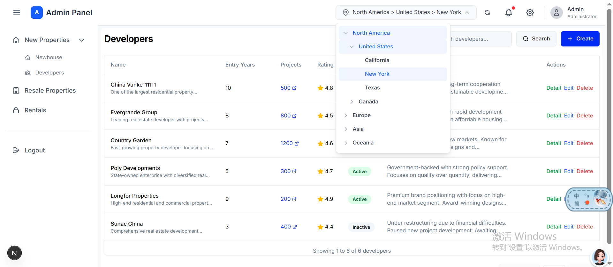

# Real Estate Management System

## Project Overview

https://next-js-panel-tszd.vercel.app/

This is a modern Real Estate Management System built with **Next.js + Tailwind CSS + TypeScript + ShanCn**. The system provides a comprehensive backend management interface for managing property listings including new properties, resale properties, and rental properties.

### Technology Stack

- **Framework**: Next.js 16 (App Router)
- **Language**: TypeScript
- **Styling**: Tailwind CSS 4
- **Component Library**: shadcn/ui
- **State Management**: React Hooks
- **Icons**: Lucide React

### Features

- 🏠 **Property Management**: CRUD operations for new properties, resale properties, and rentals
- 🏢 **Developer Management**: Manage developer information with edit and delete capabilities
- 🔍 **Region Filtering**: Infinite-level region tree selection for location-based filtering
- 📱 **Responsive Layout**: Modern admin panel with mobile support
- 🔐 **User Authentication**: Login/logout functionality

### Live Demo

- **Development**: http://localhost:3000
- **Production**: [Deploy to Vercel](https://next-js-panel-tszd.vercel.app)

### Screenshot



## Project Structure

```
next.js-panel/
├── app/                    # Next.js App Router (Routing)
│   ├── developers/         # Developer related pages
│   │   ├── [id]/edit/      # Developer edit/detail page
│   │   └── page.tsx        # Developer list page
│   ├── newhouses/          # New property pages
│   │   ├── [id]/edit/      # Newhouse edit/detail page
│   │   └── page.tsx        # Newhouse list page
│   ├── rentals/            # Rental property pages
│   ├── resale/             # Resale property pages
│   ├── login/              # Login page
│   ├── layout.tsx          # Root layout component
│   ├── page.tsx            # Dashboard homepage
│   └── globals.css         # Global styles
├── src/                    # Source code
│   ├── components/         # Reusable components
│   │   ├── table-skeleton/ # Table skeleton loader
│   │   ├── pagination/     # Pagination component
│   │   ├── region-selector/# Region selector component
│   │   ├── confirm-dialog/ # Confirm dialog component
│   │   └── ...
│   ├── layouts/            # Layout components
│   │   ├── header/         # Top navigation bar
│   │   ├── sidebar/        # Side navigation menu
│   │   └── main-content/   # Main content wrapper
│   ├── modules/            # Business modules
│   │   └── newhouse/       # Property management module
│   │       ├── api/        # API interfaces
│   │       │   ├── developerApi.ts
│   │       │   └── newhouseApi.ts
│   │       ├── components/  # Shared components
│   │       │   ├── DeveloperForm.tsx
│   │       │   ├── DeveloperCreateModal.tsx
│   │       │   ├── NewhouseForm.tsx
│   │       │   └── NewhouseCreateModal.tsx
│   │       ├── hooks/       # Custom hooks
│   │       │   ├── useDeveloper.ts
│   │       │   └── useNewhouse.ts
│   │       ├── mock/        # Mock data
│   │       ├── models/      # Data models
│   │       ├── pages/       # Page components
│   │       │   ├── developer/ # Developer pages
│   │       │   │   ├── List.tsx
│   │       │   │   └── Edit.tsx
│   │       │   └── newhouse/   # Newhouse pages
│   │       │       ├── List.tsx
│   │       │       └── Edit.tsx
│   │       └── utils/       # Utility functions
│   ├── core/               # Core utilities
│   │   ├── store/          # State management (AppContext)
│   │   └── ...
│   ├── config/             # Configuration files
│   │   └── routeConfig.ts  # Route configuration
│   ├── data/               # Data files
│   │   └── regions.ts      # Region tree data
│   └── ui/                 # UI component library
│       ├── button/         # Button component
│       ├── input/          # Input component
│       ├── card/           # Card component
│       ├── table/          # Table component
│       ├── dialog/         # Dialog component
│       └── ...
├── public/                 # Static assets
├── next.config.ts          # Next.js configuration
├── package.json            # Dependencies and scripts
└── tsconfig.json           # TypeScript configuration
```

## Environment & Setup

### Prerequisites

- Node.js >= 18.17.0
- npm >= 9.6.7

### Installation

```bash
# Clone the repository
git clone <repository-url>

# Navigate to project directory
cd next.js-panel

# Install dependencies
npm install
```

### Development

```bash
npm run dev
```

After starting the development server, visit http://localhost:3000 to view the application.

### Production Build

```bash
# Build the application
npm run build

# Start production server
npm start
```

### Linting

```bash
# Run ESLint
npm run lint
```

## Contact

For questions or collaboration, please contact:

- 📧 Email: wuc939727@gmail.com

## License

This project is for personal learning and demonstration purposes only.